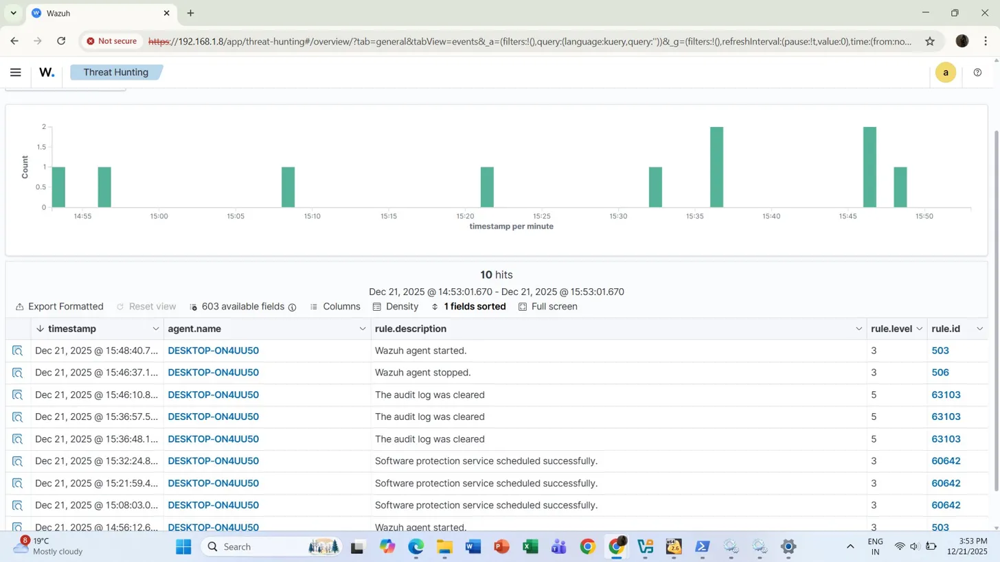
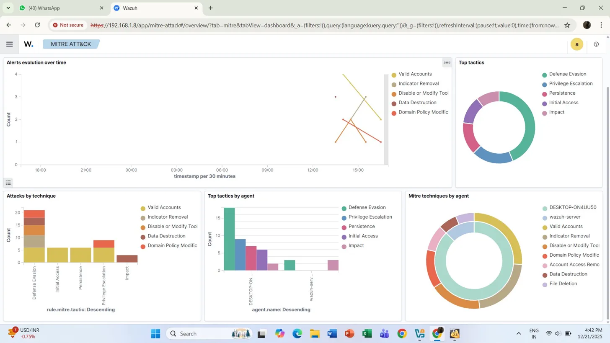
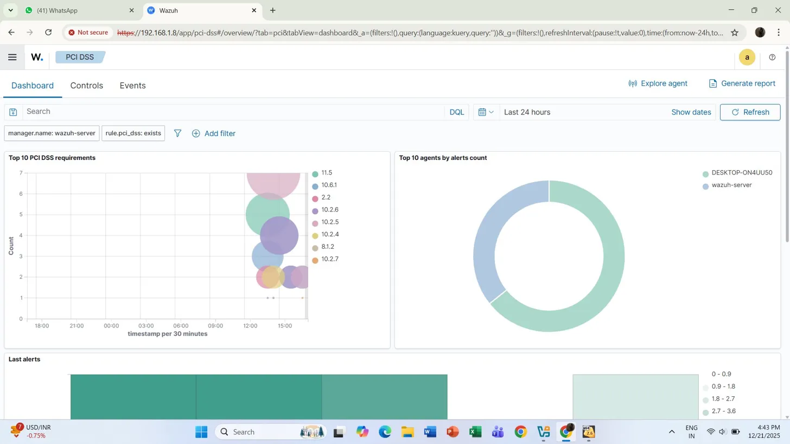
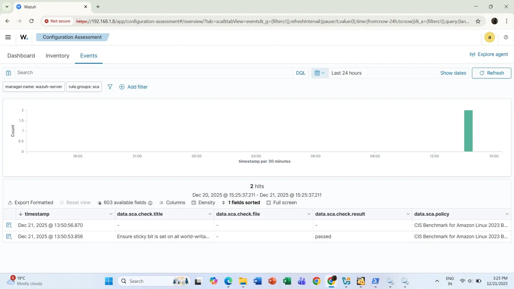

# 🛡️ Wazuh SIEM Homelab — Security Monitoring & Threat Detection

> A hands-on cybersecurity homelab built using **Wazuh SIEM** to simulate real-world SOC (Security Operations Center) analyst workflows — including agent deployment, threat detection, log analysis, MITRE ATT&CK mapping, and compliance monitoring.


---

## 📌 Project Overview

This project demonstrates the **full setup and operation of a SIEM system** using Wazuh, deployed on a local network in two configurations — a bare-metal server and a VirtualBox OVA virtual machine. It covers endpoint monitoring, real-time alert analysis, threat hunting with DQL queries, MITRE ATT&CK technique mapping, CIS benchmark compliance, and PCI DSS monitoring.

These are core skills used by professional **SOC Analysts and Cybersecurity Engineers**.

---

## 🖥️ Lab Environment

| Component | Details |
|-----------|---------|
| **Wazuh Version** | v4.14.1 |
| **Setup 1** | Bare-metal server at `192.168.1.8` |
| **Setup 2** | VirtualBox OVA VM at `192.168.1.15` |
| **Monitored Agent** | DESKTOP-ON4UU50 (Windows 11 Home, `192.168.1.11`) |
| **Agent Version** | Wazuh Agent v4.14.1 |
| **Cluster Node** | node01 |
| **Lab Date** | December 21, 2025 |

---

## 🏗️ Lab Architecture

```
┌──────────────────────────┐         ┌──────────────────────────────────┐
│   Windows 11 Agent       │◄───────►│   Wazuh Server                   │
│   DESKTOP-ON4UU50        │  Agent  │   192.168.1.8  (bare-metal)      │
│   192.168.1.11           │ Comms   │   192.168.1.15 (VirtualBox OVA)  │
│   Wazuh v4.14.1          │         │   Manager + Indexer + Dashboard   │
└──────────────────────────┘         └──────────────────────────────────┘
```

---

## 🧰 Tools & Technologies

| Tool | Purpose |
|------|---------|
| **Wazuh SIEM** | Core security monitoring and SIEM platform |
| **VirtualBox + OVA** | VM-based Wazuh server deployment |
| **Windows 11** | Monitored endpoint (Wazuh agent installed) |
| **MITRE ATT&CK Framework** | Threat classification and technique mapping |
| **CIS Benchmark (Amazon Linux 2023)** | System hardening and compliance checks |
| **PCI DSS** | Payment card security compliance monitoring |
| **DQL (Dashboards Query Language)** | Custom log querying and threat hunting |

---

## 🔍 What I Did — Lab Activities

### 1. 📦 Wazuh Deployment (Two Methods)
- Installed Wazuh server using the **OVA appliance in VirtualBox** (VM-based)
- Separately configured a **bare-metal Wazuh server** on the local network
- Deployed and registered the **Windows 11 Wazuh agent** on both setups
- Verified agent connectivity, version, and group assignment via the Endpoints dashboard

### 2. 📊 Dashboard & Alert Monitoring

**Bare-metal setup (192.168.1.8):**
- 0 Critical, 0 High, **4 Medium**, **7 Low** severity alerts in 24 hours

**VM-based setup (192.168.1.15):**
- 0 Critical, 0 High, **357 Medium**, **156 Low** severity alerts
- Explored all modules: Endpoint Security, Threat Intelligence, Security Operations, Cloud Security, File Integrity Monitoring, Malware Detection, Vulnerability Detection

### 3. 🕵️ Threat Hunting with DQL Queries

| DQL Query | Total Hits | MITRE Technique Detected |
|-----------|-----------|--------------------------|
| `authentication_failed` | 2 | **Account Access Removal** |
| `agent stopped` | 4 | **Disable or Modify Tool** |
| `wazuh agents` | 5 | **Data Destruction + File Deletion** |
| *(Full dashboard)* | 33 | Multiple — see MITRE section |

### 4. 🗂️ Log Detection & Event Analysis

Analyzed **39 total events** over 24 hours. Key rules triggered:

| Rule ID | Description | Level | Significance |
|---------|-------------|-------|-------------|
| **63103** | The audit log was cleared ⚠️ | 5 | Classic attacker cover-tracks technique |
| **506** | Wazuh agent stopped | 3 | Potential tamper/disable attempt |
| **503** | Wazuh agent started | 3 | Agent lifecycle monitoring |
| **60642** | Software protection service scheduled | 3 | System service activity |

> 🚨 **Key finding:** Audit log clearing (Rule 63103) appeared **3 times** — a well-known attacker technique to destroy forensic evidence, caught automatically by Wazuh.

### 5. 🎯 MITRE ATT&CK Mapping

| Tactic | Techniques Observed |
|--------|-------------------|
| **Defense Evasion** | Disable or Modify Tool, Indicator Removal (20+ events) |
| **Privilege Escalation** | Valid Accounts |
| **Persistence** | Domain Policy Modification |
| **Initial Access** | Valid Accounts |
| **Impact** | Data Destruction, File Deletion |

### 6. ⚙️ Configuration Assessment (CIS Benchmark)

- Ran **CIS Benchmark for Amazon Linux 2023** scans
- Used `rule.groups: sca` filter to isolate SCA events
- Result: *"Ensure sticky bit is set on all world-writable directories"* → ✅ **Passed**

### 7. 🏦 PCI DSS Compliance Monitoring

| PCI DSS Requirement | Area |
|--------------------|------|
| 10.2, 10.4, 10.5, 10.6 | Audit log management |
| 11.5 | Change detection mechanisms |
| 8.1 | User identification and authentication |
| 2.2 | System configuration standards |

---

## 📸 Screenshots

### Overview Dashboard


### Endpoints — Active Agent


### Threat Hunting — Authentication Failed


### Threat Hunting — Agent Stopped


### Threat Hunting — Full Dashboard (33 total alerts)


### Event Log — 39 Hits (Audit Log Cleared, Agent Events)


### MITRE ATT&CK Dashboard


### PCI DSS Compliance


### Configuration Assessment (CIS Benchmark)


---

## 🧠 Key Skills Demonstrated

- ✅ Wazuh SIEM deployment via OVA (VirtualBox) and bare-metal server
- ✅ Windows 11 endpoint agent deployment and registration
- ✅ Real-time alert monitoring and severity triage
- ✅ Active threat hunting with DQL queries
- ✅ MITRE ATT&CK framework — identifying live tactics and techniques
- ✅ Log analysis and event correlation (39+ events)
- ✅ Detecting audit log clearing — a real attacker evasion technique
- ✅ CIS Benchmark compliance assessment (Amazon Linux 2023)
- ✅ PCI DSS compliance monitoring
- ✅ Windows 11 endpoint security monitoring

---

## 🚀 How to Replicate This Lab

### Option A — VirtualBox OVA (Easiest)
1. Download **Wazuh OVA** from [wazuh.com/install](https://wazuh.com/install/)
2. Import into **VirtualBox** → File → Import Appliance
3. Start the VM, note the IP address shown on boot
4. Access `https://<vm-ip>` in browser

### Option B — Bare-metal Install
1. Install on Ubuntu 22.04 using the [Wazuh quickstart guide](https://documentation.wazuh.com/current/quickstart.html)

### Deploy Windows Agent
1. Dashboard → Endpoints → Deploy new agent → Select Windows
2. Enter manager IP, copy the PowerShell install command
3. Run as Administrator on the Windows machine
4. Verify agent shows as Active in Endpoints

### Run Threat Hunts
```
# Threat Hunting → DQL search bar
authentication_failed       # Detect failed logins
agent stopped               # Detect agent tampering
audit log cleared           # Detect log wiping
wazuh agents                # Monitor agent activity
```

---

## 📂 Repository Structure

```
wazuh-siem-homelab/
│
├── README.md
└── screenshots/
    ├── 01_overview_dashboard.png
    ├── 02_endpoints.png
    ├── 03_threat_hunting_auth_failed.png
    ├── 04_threat_hunting_agent_stopped.png
    ├── 05_threat_hunting_full.png
    ├── 06_event_logs.png
    ├── 07_mitre_attck.png
    ├── 08_pci_dss.png
    └── 09_config_assessment.png
```

---

## 👩‍💻 Author

**Annanya Oberoi**  
CS Undergrad (3rd Year) · Delhi, India  
🔗 [GitHub](https://github.com/annanyaoberoi) | Open to Cybersecurity & Data Analyst Internships

---

## 📄 License

This project is for educational purposes. All screenshots are from a personal homelab environment on a private local network.
